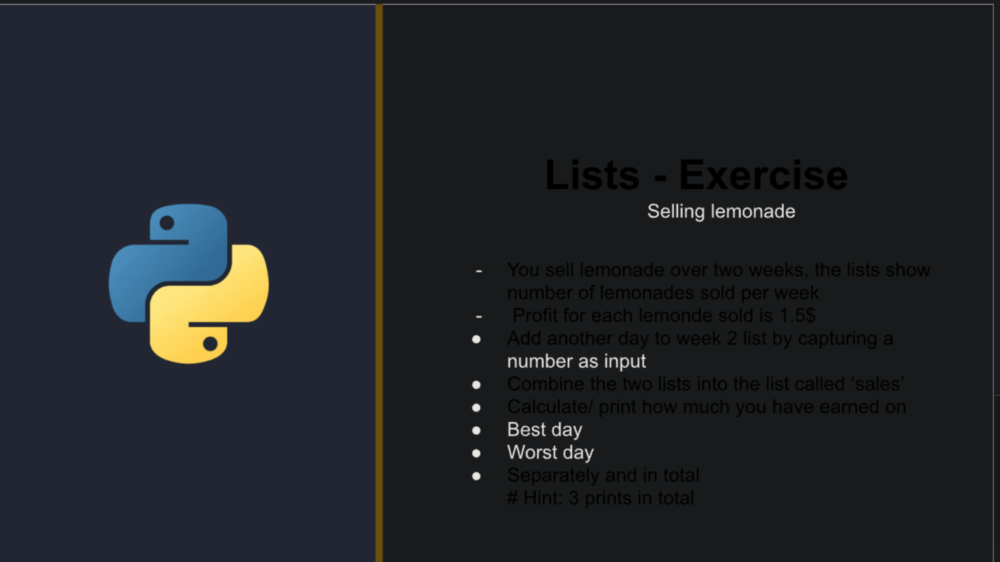
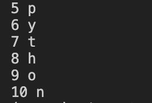

## Notees




---
In Python, a tuple is an ordered, immutable collection of elements. Tuples are similar to lists, but they have some key differences:

1. Immutability: Once a tuple is created, its elements cannot be changed. You cannot add, remove, or modify elements in a tuple.

2. Syntax: Tuples are defined using parentheses `()`, although the parentheses are optional in some cases. Elements in a tuple are separated by commas.

Here are some examples of creating and using tuples in Python:

1. Creating a tuple:
```python
my_tuple = (1, 2, 3)
another_tuple = 4, 5, 6  # Parentheses are optional
empty_tuple = ()
single_element_tuple = (7,)  # Note the trailing comma
```

2. Accessing elements in a tuple:
```python
my_tuple = (1, 2, 3)
print(my_tuple[0])  # Output: 1
print(my_tuple[1:])  # Output: (2, 3)
```

3. Attempting to modify a tuple (raises an error):
```python
my_tuple = (1, 2, 3)
my_tuple[0] = 4  # Raises a TypeError: 'tuple' object does not support item assignment
```

4. Tuple unpacking:
```python
my_tuple = (1, 2, 3)
a, b, c = my_tuple
print(a)  # Output: 1
print(b)  # Output: 2
print(c)  # Output: 3
```

5. Tuple methods:
```python
my_tuple = (1, 2, 3, 2, 4)
print(my_tuple.count(2))  # Output: 2
print(my_tuple.index(3))  # Output: 2
```

6. Iterating over a tuple:
```python
my_tuple = (1, 2, 3)
for item in my_tuple:
    print(item)
```

Tuples are commonly used in situations where you want to store a collection of related values that should not be modified. They are faster than lists and can be used as keys in dictionaries or as elements in sets.

Some common use cases for tuples include:
- Returning multiple values from a function
- Representing a fixed set of values, such as coordinates or database records
- Passing immutable arguments to functions

Tuples provide a way to create immutable sequences of elements in Python, ensuring that the data remains unchanged throughout the program's execution.

---

- Sets are unordered, and there can be no duplicates in them

Python provides three built-in types for storing collections of data: lists, tuples, and sets. Each has its own characteristics and use cases:

### Lists
- **Mutable:** You can change, add, or remove elements.
- **Ordered:** The elements have a defined order, and that order will not change.
- **Syntax:** Created using square brackets `[]`.
- **Duplicates Allowed:** Lists can contain duplicate elements.
- **Example Usage:** When you need a collection that can change over time, and order matters.

```python
my_list = [1, 2, 3, 3]
my_list.append(4)  # Adding an element
print(my_list)  # Output: [1, 2, 3, 3, 4]
```

### Tuples
- **Immutable:** Once created, you cannot change, add, or remove elements.
- **Ordered:** The elements have a defined order.
- **Syntax:** Created using parentheses `()`, but can also be defined without them.
- **Duplicates Allowed:** Tuples can contain duplicate elements.
- **Example Usage:** When you need an ordered collection of items that should not change through the program.

```python
my_tuple = (1, 2, 3, 3)
# my_tuple.append(4) would raise an AttributeError
print(my_tuple)  # Output: (1, 2, 3, 3)
```

### Sets
- **Mutable:** You can add or remove elements, but you cannot change existing elements.
- **Unordered:** The elements do not have a defined order, and their order can change.
- **Syntax:** Created using curly braces `{}` or the `set()` function for an empty set.
- **Duplicates Not Allowed:** Sets automatically remove duplicate elements.
- **Example Usage:** When you need to ensure all elements are unique or to perform set operations like union, intersection.

```python
my_set = {1, 2, 3, 3}
my_set.add(4)  # Adding an element
print(my_set)  # Output: {1, 2, 3, 4} because duplicates are not allowed
```

### Choosing Between Them
- Use **lists** when you need an ordered collection that you might need to alter.
- Use **tuples** for ordered collections of items that should not change.
- Use **sets** when you need uniqueness for the elements and don't care about the order.


---


# while condition:
#     code
#     iterator
# Three Loop Questions:
#1. What do I want to repeat?
#  -> message
#2. What do I want to change each time?
#  -> 
#3. How long should we repeat?
#  -> 

    
    
---
## Enumerate 
- used to add numbers to a list 
- syntax:
  ```python
  for num, letter in enumrate('python',start=5):
    print(num,letter)

    ```
Output:


---
## Sort() and Sorted()

- 