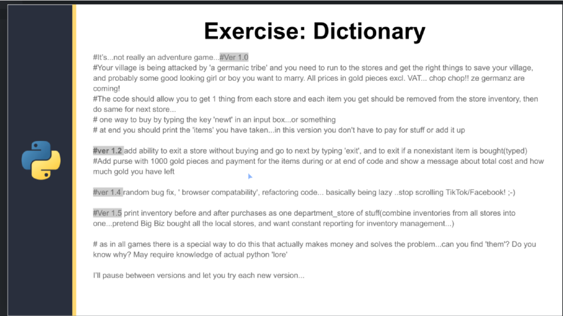
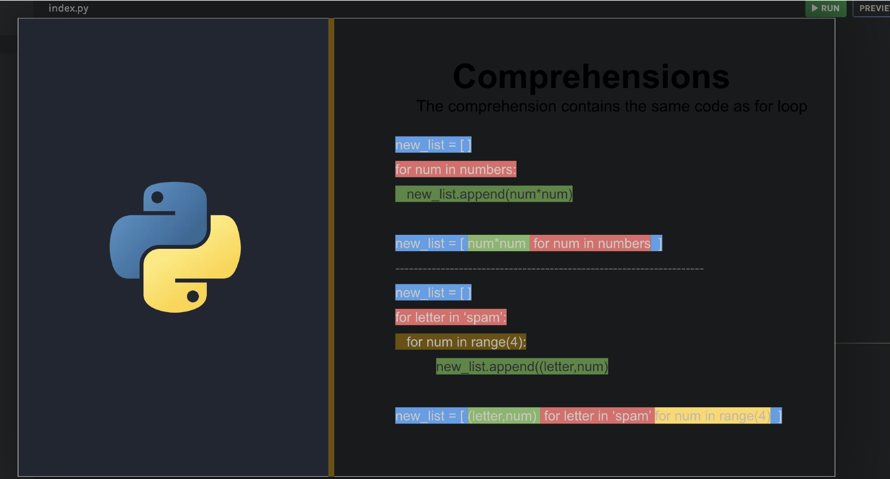

## Notees


---
In Python, a tuple is an ordered, immutable collection of elements. Tuples are similar to lists, but they have some key differences:

1. Immutability: Once a tuple is created, its elements cannot be changed. You cannot add, remove, or modify elements in a tuple.

2. Syntax: Tuples are defined using parentheses `()`, although the parentheses are optional in some cases. Elements in a tuple are separated by commas.

Here are some examples of creating and using tuples in Python:

1. Creating a tuple:
```python
my_tuple = (1, 2, 3)
another_tuple = 4, 5, 6  # Parentheses are optional
empty_tuple = ()
single_element_tuple = (7,)  # Note the trailing comma
```

2. Accessing elements in a tuple:
```python
my_tuple = (1, 2, 3)
print(my_tuple[0])  # Output: 1
print(my_tuple[1:])  # Output: (2, 3)
```

3. Attempting to modify a tuple (raises an error):
```python
my_tuple = (1, 2, 3)
my_tuple[0] = 4  # Raises a TypeError: 'tuple' object does not support item assignment
```

4. Tuple unpacking:
```python
my_tuple = (1, 2, 3)
a, b, c = my_tuple
print(a)  # Output: 1
print(b)  # Output: 2
print(c)  # Output: 3
```

5. Tuple methods:
```python
my_tuple = (1, 2, 3, 2, 4)
print(my_tuple.count(2))  # Output: 2
print(my_tuple.index(3))  # Output: 2
```

6. Iterating over a tuple:
```python
my_tuple = (1, 2, 3)
for item in my_tuple:
    print(item)
```

Tuples are commonly used in situations where you want to store a collection of related values that should not be modified. They are faster than lists and can be used as keys in dictionaries or as elements in sets.

Some common use cases for tuples include:
- Returning multiple values from a function
- Representing a fixed set of values, such as coordinates or database records
- Passing immutable arguments to functions

Tuples provide a way to create immutable sequences of elements in Python, ensuring that the data remains unchanged throughout the program's execution.

---

- Sets are unordered, and there can be no duplicates in them

Python provides three built-in types for storing collections of data: lists, tuples, and sets. Each has its own characteristics and use cases:

### Lists
- **Mutable:** You can change, add, or remove elements.
- **Ordered:** The elements have a defined order, and that order will not change.
- **Syntax:** Created using square brackets `[]`.
- **Duplicates Allowed:** Lists can contain duplicate elements.
- **Example Usage:** When you need a collection that can change over time, and order matters.

```python
my_list = [1, 2, 3, 3]
my_list.append(4)  # Adding an element
print(my_list)  # Output: [1, 2, 3, 3, 4]
```

### Tuples
- **Immutable:** Once created, you cannot change, add, or remove elements.
- **Ordered:** The elements have a defined order.
- **Syntax:** Created using parentheses `()`, but can also be defined without them.
- **Duplicates Allowed:** Tuples can contain duplicate elements.
- **Example Usage:** When you need an ordered collection of items that should not change through the program.

```python
my_tuple = (1, 2, 3, 3)
# my_tuple.append(4) would raise an AttributeError
print(my_tuple)  # Output: (1, 2, 3, 3)
```

### Sets
- **Mutable:** You can add or remove elements, but you cannot change existing elements.
- **Unordered:** The elements do not have a defined order, and their order can change.
- **Syntax:** Created using curly braces `{}` or the `set()` function for an empty set.
- **Duplicates Not Allowed:** Sets automatically remove duplicate elements.
- **Example Usage:** When you need to ensure all elements are unique or to perform set operations like union, intersection.

```python
my_set = {1, 2, 3, 3}
my_set.add(4)  # Adding an element
print(my_set)  # Output: {1, 2, 3, 4} because duplicates are not allowed
```

### Choosing Between Them
- Use **lists** when you need an ordered collection that you might need to alter.
- Use **tuples** for ordered collections of items that should not change.
- Use **sets** when you need uniqueness for the elements and don't care about the order.


---


# while condition:
#     code
#     iterator
# Three Loop Questions:
#1. What do I want to repeat?
#  -> message
#2. What do I want to change each time?
#  -> 
#3. How long should we repeat?
#  -> 

    
    
---
## Enumerate 
- used to add numbers to a list 
- syntax:
  ```python
  for num, letter in enumrate('python',start=5):
    print(num,letter)

    ```
Output:


---
## Sort() and Sorted()
In Python, sorting is a common operation that can be performed using either the `sort()` method available on lists or the `sorted()` function that works with any iterable. Both are used to order the elements of a collection in ascending or descending order. The key difference between them lies in how they return the sorted sequence and what types of data they can operate on.

### `sort()` Method

The `sort()` method modifies the list it is called on in place, meaning it changes the original list and does not return a new list. This method is only available for lists.

**Syntax**:
```python
list.sort(key=None, reverse=False)
```

- `key` (optional): A function that serves as a key for the sort comparison.
- `reverse` (optional): A boolean value. If set to `True`, the list elements are sorted as if each comparison were reversed.

**Example**:
```python
nums = [3, 1, 4, 1, 5, 9, 2]
nums.sort()
print(nums)
# Output: [1, 1, 2, 3, 4, 5, 9]
```

### `sorted()` Function

The `sorted()` function returns a new sorted list from the elements of any iterable, without modifying the original data structure. It can be used with lists, tuples, dictionaries (sorting by keys), and other iterables.

**Syntax**:
```python
sorted(iterable, key=None, reverse=False)
```

- `iterable`: The sequence to be sorted.
- `key` (optional): A function that serves as a key for the sort comparison.
- `reverse` (optional): A boolean value. If set to `True`, the resulting list is sorted in descending order.

**Example**:
```python
nums = (3, 1, 4, 1, 5, 9, 2)  # This is a tuple.
sorted_nums = sorted(nums)
print(sorted_nums)
# Output: [1, 1, 2, 3, 4, 5, 9]
```

### Custom Sorting with `key`

Both `sort()` and `sorted()` accept a `key` parameter for custom sorting. For example, to sort a list of strings by their lengths:

```python
words = ['banana', 'pie', 'Washington', 'book']
words.sort(key=len)
print(words)
# Output: ['pie', 'book', 'banana', 'Washington']

# Using sorted() for the same purpose
sorted_words = sorted(words, key=len)
print(sorted_words)
# Output: ['pie', 'book', 'banana', 'Washington']
```

When using the `key` parameter, you pass a function that takes a single argument and returns a key to use for sorting purposes. This allows for flexible and powerful sorting capabilities.

## Dictionaries





## Filehandling - Reading Files

File handling in Python is a critical skill for reading from and writing to files on your computer. Python provides built-in functions for opening, reading, writing, and closing files. Here's a basic guide to file handling operations:

### Opening a File
Use the `open()` function to open a file. The syntax is:
```python
file_object = open(file_name, access_mode)
```
- `file_name` is the name of the file to be opened.
- `access_mode` determines the mode in which the file has to be opened, e.g., read, write, append, etc. Common modes include:
  - `'r'` for reading (default),
  - `'w'` for writing (creates a new file or truncates the existing file),
  - `'a'` for appending,
  - `'b'` for binary mode,
  - `'+'` for read/write mode.

### Reading from a File
- **Read the entire file**: Use `file_object.read()`.
- **Read one line at a time**: Use `file_object.readline()`.
- **Read all lines as a list**: Use `file_object.readlines()`.

Example:
```python
with open('example.txt', 'r') as file:
    content = file.read()
    print(content)
```

### Writing to a File
- **Write a string**: Use `file_object.write(string)`.
- **Write multiple strings**: Use `file_object.writelines(list_of_strings)`.

Example:
```python
with open('example.txt', 'w') as file:
    file.write("Hello, World!")
```

### Appending to a File
Similar to writing, but opens the file in append mode `'a'` so that new data will be added at the end of the file.
```python
with open('example.txt', 'a') as file:
    file.write("\nAppending a new line.")
```

### Closing a File
It's crucial to close a file after your operations are done to free up system resources. The `with` statement automatically handles this.
```python
with open('example.txt', 'r') as file:
    content = file.read()
# No need to explicitly call file.close() here
```

### The `with` Statement
The `with` statement simplifies exception handling by encapsulating common preparation and cleanup tasks in so-called context managers. For file operations, it ensures that the file is properly closed after its suite finishes, even if an exception is raised on the way.

This basic overview covers fundamental file handling operations in Python. Depending on your specific needs, you might explore more advanced topics like working with files in binary mode or handling large files in chunks.

## Exceptions: Try/Except, Raise
In Python, the `try` and `except` blocks are used for exception handling, allowing you to catch and handle errors or exceptions that occur during the execution of a block of code. Here's how they work:

- **`try` block**: You wrap the code that might throw an exception in a `try` block.
- **`except` block**: If an exception occurs in the `try` block, the flow of control is passed to an `except` block, allowing you to handle the error.

Here's a simple example to illustrate their use:

```python
try:
    # Code block where you suspect an error may occur
    result = 10 / 0
except ZeroDivisionError:
    # Handling a specific exception
    print("You can't divide by zero!")
except Exception as e:
    # Handling any other exceptions
    print(f"An error occurred: {e}")
else:
    # This block is executed if no exceptions are raised
    print("Operation successful.")
finally:
    # This block is executed no matter what, and is often used for cleanup
    print("Execution completed.")
```

In this example:
- The `try` block contains code that will raise a `ZeroDivisionError`.
- The first `except` block catches and handles the `ZeroDivisionError`, printing a message to the user.
- The second `except` block is a generic catch-all for any other exceptions that might occur. It captures the exception as `e` and prints a message.
- The `else` block would run only if no exceptions are caught. Since an exception is raised in the `try` block, the `else` block is skipped.
- The `finally` block runs regardless of whether an exception was caught or not, making it useful for cleanup activities, such as closing files or releasing resources.

## Classes and Objects
- Classes are blueprints
- Objects are the actual things you built
- variables are attributes
- functions are methods

In Python, classes and objects are the core concepts of object-oriented programming (OOP). A class is a blueprint for creating objects, providing initial values for state (member variables) and implementations of behavior (member functions or methods). Objects are instances of classes; they are the realized version of the class blueprint.

### Defining a Class

A class is defined using the `class` keyword, followed by the class name and a colon. Inside the class, you can define functions (methods) and variables (attributes) that belong to the class.

```python
class MyClass:
    # Class attribute
    attribute = "This is a class attribute."

    # Initializer / Instance attributes
    def __init__(self, value):
        self.instance_attribute = value

    # Method
    def my_method(self):
        return f"The value is {self.instance_attribute}"
```

- The `__init__` method is a special method called a constructor. It's used for initializing instance attributes of a new object.
- `self` represents the instance of the class and allows access to its attributes and methods.

### Creating an Object

To create an object (an instance of a class), you simply call the class using its name and pass the arguments that its `__init__` method accepts.

```python
my_object = MyClass("Hello, World!")
```

### Accessing Attributes and Methods

You can access an object's attributes and methods using the dot `.` notation.

```python
# Accessing an attribute
print(my_object.instance_attribute)  # Output: Hello, World!

# Calling a method
print(my_object.my_method())  # Output: The value is Hello, World!
```

### Example: A Simple Class

Here's a simple example of a class representing a Dog. This class will have attributes to store the dog's name and age, and a method to make the dog sit.

```python
class Dog:
    def __init__(self, name, age):
        self.name = name
        self.age = age

    def sit(self):
        print(f"{self.name} is now sitting.")

    def birthday(self):
        self.age += 1
        print(f"Happy Birthday {self.name}! You're now {self.age} years old.")

# Creating instances of Dog
my_dog = Dog("Rex", 2)
your_dog = Dog("Luna", 3)

# Calling methods on our Dog instance
my_dog.sit()
your_dog.birthday()
```

This example illustrates how you can encapsulate behaviors (like sitting or celebrating a birthday) and attributes (like name and age) related to a dog within a class. Each `Dog` object created from the `Dog` class can have its own name and age, demonstrating how classes allow for data encapsulation and reuse of code.

## Inheritance


Class inheritance in Python allows one class (the child or subclass) to inherit the attributes and methods of another class (the parent or superclass). This mechanism facilitates code reuse and creates a hierarchical organization of classes. Inheritance models an "is a" relationship between two entities.

Basic Syntax of Inheritance
Here's how you can define a class that inherits from another class in Python:

```python
Copy
class Parent:
    def __init__(self):
        self.attribute = "This is a parent attribute"

    def parent_method(self):
        print("This is a parent method")

class Child(Parent):
    def child_method(self):
        print("This is a child method")
In this example, Child inherits from Parent, meaning Child instances can access Parent's attributes and methods.

Overriding Methods
A child class can override methods of the parent class if it needs to implement a different behavior for the same method name:

python
Copy
class Parent:
    def common_method(self):
        print("Parent's common_method()")

class Child(Parent):
    def common_method(self):
        print("Child's overridden common_method()")
Extending the Parent's Initialization with super()
Often, you'll want to add some initialization to the child class while still calling the parent's initialization method. You can do this with super():

python
Copy
class Parent:
    def __init__(self, value):
        self.value = value

class Child(Parent):
    def __init__(self, value, extra):
        super().__init__(value)  # Call parent's __init__
        self.extra = extra
Multi-level Inheritance
Python supports multi-level inheritance, where a class can inherit from a child class, creating a hierarchy of inheritance.

python
Copy
class Grandparent:
    def grandparent_method(self):
        print("Grandparent method")

class Parent(Grandparent):
    def parent_method(self):
        print("Parent method")

class Child(Parent):
    def child_method(self):
        print("Child method")
Multiple Inheritance
Python also supports multiple inheritance, where a class can inherit from more than one parent class. This should be used with caution to avoid complexity and ambiguity.

python
Copy
class Father:
    def skill(self):
        print("Father's skill")

class Mother:
    def skill(self):
        print("Mother's skill")

class Child(Father, Mother):
    pass

child = Child()
child.skill()  # This will call the first parent's skill method in the order of inheritance.
When using multiple inheritance, Python follows the method resolution order (MRO) to determine which method to use in case of conflicts. You can view the MRO of a class by using the ClassName.__mro__ attribute or the help(ClassName) command.

Inheritance is a powerful feature of object-oriented programming that promotes code reuse and creates a logical and hierarchical organization of classes.
```


## Modules 
In Python, a module is a file containing Python definitions and statements. The file name is the module name with the suffix `.py` added. Modules in Python are a way to organize code into reusable parts, making it easier to understand and maintain the codebase. Modules can define functions, classes, and variables, as well as runnable code.

### Creating a Module

To create a module, simply save your code in a new file with a `.py` extension. For example, let's create a simple module named `mymodule.py`:

```python
# mymodule.py

def greet(name):
    print(f"Hello, {name}!")

favorite_food = "pizza"
```

### Using a Module

You can use any Python file as a module by executing an `import` statement in another Python script or interactive instance.

```python
import mymodule

mymodule.greet("Alice")  # Output: Hello, Alice!
print(mymodule.favorite_food)  # Output: pizza
```

### Importing Specific Items

You can choose to import specific attributes or functions from a module directly into your namespace:

```python
from mymodule import greet, favorite_food

greet("Bob")  # Output: Hello, Bob!
print(favorite_food)  # Output: pizza
```

### Renaming a Module

You can rename a module or its components on import using the `as` keyword. This is particularly useful when dealing with modules or functions with long or conflicting names:

```python
import mymodule as mm

mm.greet("Carol")  # Output: Hello, Carol!
```

Or for specific items:

```python
from mymodule import greet as g

g("Dave")  # Output: Hello, Dave!
```

### The `dir()` Function

To find out which names a module defines, you can use the `dir()` function. It returns a sorted list of strings containing the names defined by a module.

```python
import mymodule

print(dir(mymodule))
```

This will list all types of names: variables, modules, functions, etc.

### The `__name__` Attribute

Every module has a built-in attribute `__name__`, which returns the name of the module. However, when a module is run as the main program, `__name__` is set to the string `"__main__"`.

```python
# mymodule.py

if __name__ == "__main__":
    print("The module is being run directly")
else:
    print("The module is being imported")
```

This technique allows for the module's code to be used both as an importable module and as a standalone script by distinguishing the context in which it is run.

Modules are a fundamental concept in Python and form the basis of many advanced programming patterns and techniques, including packages and namespaces.


## Zip / Unzip
In Python, the zip() function is a built-in function that aggregates elements from two or more iterables (like lists or tuples) and returns an iterator of tuples, where each tuple contains elements from the iterables passed to zip() based on their positions. This is particularly useful when you need to pair or group elements from different sequences together.

Given your selected text with lists nums, letters, and names, here's how you could use the zip() function:

Using zip()
python
Copy
nums = [1,2,3,4] 
letters = ['a','b','c','d']
names = ['John','Eric','Michael','Graham','Joe']

# Zip the lists together
zipped_list = list(zip(nums, letters, names))

print(zipped_list)
This would output:

css
Copy
[(1, 'a', 'John'), (2, 'b', 'Eric'), (3, 'c', 'Michael'), (4, 'd', 'Graham')]
Each tuple in the resulting list contains one element from each of the original lists, grouped by their position. Note that because names has more elements than the other lists, the extra elements ('Joe') are ignored by zip() because it stops when the shortest input iterable is exhausted.

Unzipping with zip()
You can also "unzip" a list of tuples into separate lists using the zip() function combined with the unpacking operator *. This essentially reverses the zip operation:

python
Copy
# Assuming zipped_list is the result of the zip operation above
unzipped = zip(*zipped_list)

nums_unzipped, letters_unzipped, names_unzipped = list(unzipped)

print(nums_unzipped)
print(letters_unzipped)
print(names_unzipped)
This would output:

arduino
Copy
(1, 2, 3, 4)
('a', 'b', 'c', 'd')
('John', 'Eric', 'Michael', 'Graham')
Here, nums_unzipped, letters_unzipped, and names_unzipped are tuples containing the grouped elements from the original lists.

Remember, the result of zip(*zipped_list) is an iterator. To see the contents, you need to convert it to a list or iterate through it. Also, the unzip operation returns tuples for each of the original lists.


## Lambda Functions 1 and 2
Lambda functions in Python are small anonymous functions defined with the `lambda` keyword. They can have any number of arguments but can only have one expression. Lambda functions are often used for short, simple functions that are convenient to define at the point where they are used, typically with functions like `map()`, `filter()`, and `sorted()` among others.

### Syntax

The basic syntax of a lambda function is:

```python
lambda arguments: expression
```

The expression is executed and returned when the lambda function is called.

### Examples

#### Example 1: Adding Two Numbers

```python
add = lambda x, y: x + y
print(add(5, 3))  # Output: 8
```

#### Example 2: Squaring a Number

```python
square = lambda x: x ** 2
print(square(4))  # Output: 16
```

#### Example 3: Filtering a List

Here, `lambda` is used with `filter()` to filter out even numbers from a list.

```python
nums = [1, 2, 3, 4, 5, 6]
even_nums = list(filter(lambda x: (x % 2 == 0), nums))
print(even_nums)  # Output: [2, 4, 6]
```

#### Example 4: Sorting a List of Tuples

Using `lambda` with `sorted()` to sort a list of tuples by the second item:

```python
tuples_list = [(1, 'z'), (2, 'a'), (3, 'q')]
sorted_list = sorted(tuples_list, key=lambda x: x[1])
print(sorted_list)  # Output: [(2, 'a'), (3, 'q'), (1, 'z')]
```

### Advantages and Disadvantages

**Advantages**:
- Lambda functions are concise and can make the code more readable, especially when used in combination with functions like `map()`, `filter()`, and `sorted()`.
- They are useful for creating small throwaway functions without needing to formally define them using `def`.

**Disadvantages**:
- They are limited to expressions, which means they can't contain multiple expressions or statements like loops or multiple return statements.
- The use of lambda functions can sometimes make the code harder to understand, especially for beginners or in cases where the lambda function is complex.

Lambda functions offer a compact way to write functions in Python, making them a useful tool in many programming scenarios.


## Comprehensions - Lists 



## Comprehensions - Dictionary 
Python comprehensions are a concise, readable way to create lists, sets, dictionaries, and generators. They provide a more syntactically elegant method of creating collections compared to traditional loop and conditional statements. Comprehensions can make your code more expressive and easier to understand.

List Comprehensions
List comprehensions return a list, created from iterating over an iterable and optionally filtering items based on a condition.

Syntax:

python
Copy
[expression for item in iterable if condition]
Example: Create a list of squares for even numbers from 0 to 9.

python
Copy
squares_even = [x**2 for x in range(10) if x % 2 == 0]
print(squares_even)  # Output: [0, 4, 16, 36, 64]
Set Comprehensions
Set comprehensions return a set, which is similar to list comprehensions but produces a set, which means duplicate values are eliminated.

Syntax:

python
Copy
{expression for item in iterable if condition}
Example: Create a set of squared values for numbers from 0 to 9.

python
Copy
squares_set = {x**2 for x in range(10)}
print(squares_set)  # Output: {0, 1, 64, 4, 36, 9, 16, 49, 81, 25}
Dictionary Comprehensions
Dictionary comprehensions return a dictionary. The expression defines both the key and the value.

Syntax:

python
Copy
{key_expression: value_expression for item in iterable if condition}
Example: Create a dictionary where keys are numbers from 1 to 5 and values are their squares.

python
Copy
squares_dict = {x: x**2 for x in range(1, 6)}
print(squares_dict)  # Output: {1: 1, 2: 4, 3: 9, 4: 16, 5: 25}
Generator Expressions
Generator expressions are similar to list comprehensions but produce a generator instead of a list. Generators are iterators that yield items one at a time, which is more memory efficient than building the entire collection at once.

Syntax:

python
Copy
(expression for item in iterable if condition)
Example: Create a generator for even numbers from 0 to 9.

python
Copy
evens_gen = (x for x in range(10) if x % 2 == 0)
print(next(evens_gen))  # Output: 0
print(next(evens_gen))  # Output: 2
# And so on...
Comprehensions can significantly reduce the amount of code required to create new collections and make your code cleaner and more Pythonic.

## Randomness
The `random` module in Python provides a suite of functions for generating pseudo-random numbers and performing random operations, such as selecting random items from a list or shuffling a list in place. This module is quite useful in simulations, games, testing, and anywhere else where random behavior is desired.

Here’s an overview of some commonly used functions and features within the `random` module:

### Importing the Module

Before you can use any functions in the `random` module, you need to import it:

```python
import random
```

### Generating Random Numbers

- **`random.random()`**: Return the next random floating point number between 0.0 and 1.0.

  ```python
  print(random.random())
  ```

- **`random.uniform(a, b)`**: Return a random floating point number between the values `a` and `b` (both included).

  ```python
  print(random.uniform(1, 10))
  ```

- **`random.randint(a, b)`**: Return a random integer `N` such that `a <= N <= b`.

  ```python
  print(random.randint(1, 100))
  ```

### Picking Elements Randomly

- **`random.choice(seq)`**: Return a random element from the non-empty sequence `seq`.

  ```python
  print(random.choice(['apple', 'banana', 'cherry']))
  ```

- **`random.choices(population, k)`**: Return a list of `k` elements chosen from the `population` with replacement.

  ```python
  import string
  letter_numbers = string.ascii_letters + string.digits
  word = random.choices(letter_numbers, k=7)
  print(''.join(word))
  ```

- **`random.sample(population, k)`**: Return a `k` length list of unique elements chosen from the `population`. Used for random sampling without replacement.

  ```python
  print(random.sample(range(100), 10))
  ```

### Shuffling Elements

- **`random.shuffle(x[, random])`**: Shuffle the sequence `x` in place.

  ```python
  items = [1, 2, 3, 4, 5]
  random.shuffle(items)
  print(items)
  ```

### Seeding

- **`random.seed(a=None, version=2)`**: Initialize the random number generator. If you use the same seed value before generating random numbers, you will get the same sequence of numbers.

  ```python
  random.seed(1)
  print(random.random()) # This will always print the same number every time it's run with seed 1.
  ```

Using the `random` module can add interesting dynamics to Python scripts, especially in areas requiring an element of unpredictability.

## Timeit and performance
The `timeit` module in Python provides a simple way to time small bits of Python code. It has both a Command-Line Interface (CLI) and a callable one. `timeit` is especially useful for timing code to identify performance bottlenecks or compare different coding approaches in terms of execution speed.

### Basic Usage

#### Using `timeit` in a Python Script

To use `timeit` in a script, you can use the `timeit.timeit()` function, which takes a statement (a piece of code as a string) that you want to time, along with the number of times you want the statement to be executed (`number`). The function returns the total time taken to execute the statement the specified number of times.

```python
import timeit

# Time how long it takes to execute 'sum(range(1000))' 1000 times.
execution_time = timeit.timeit('sum(range(1000))', number=1000)
print(execution_time)
```

#### Using `timeit` with Function Calls

If you wish to time a function call, it's more convenient to pass the function and its arguments separately using the `stmt` and `setup` parameters.

```python
import timeit

def my_function():
    return sum(range(1000))

execution_time = timeit.timeit(stmt=my_function, number=1000)
print(execution_time)
```

### Using `timeit` from the Command Line

You can also use `timeit` from the command line, which is useful for quick tests:

```sh
python -m timeit "sum(range(1000))"
```

This command will report the time it takes to execute `sum(range(1000))`.

### Setup Code

For more complex timing tasks where you need to set up some context (for example, importing a module or setting up variables), you can use the `setup` argument to provide setup code that is executed once at the beginning:

```python
import timeit

execution_time = timeit.timeit(
    'my_function()', 
    setup='from __main__ import my_function', 
    number=1000
)
print(execution_time)
```

### Timing Loops and List Comprehensions

When timing loops or list comprehensions, remember that `timeit` executes the statement in a separate namespace, so any changes made by the statement to objects in its namespace do not affect the namespace from which `timeit` is called.

### Best Practices

- For more accurate timing, increase the `number` of executions. This is particularly useful for very fast functions where execution time might be shorter than the timer's resolution.
- Use the `repeat()` function for multiple timing runs when looking for a more reliable average execution time, as it can help mitigate fluctuations in timing results.

## Project - Crypto Machine

## Project - Math Tutor

## Project - Marble / Trading Game 

## Bonus: Project - Palindromes 
